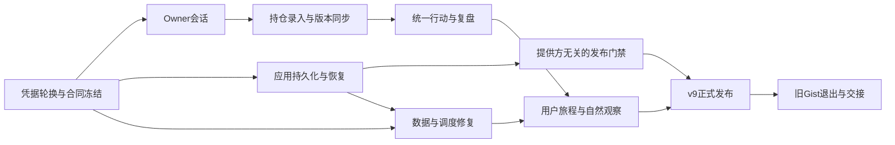

# 司南基金 v9.0.0 统筹升级方案

> 编制日期：2026-09-30（Asia/Shanghai）
> 状态：已按用户授权开始实施 Iteration 18；本地会话与隔离仓储验收已完成，线上安全/持久化出口未通过。不是发布说明，也不授予正式发布资格。
> 基线：`main / 706b6ade3cec000319e4dd5eb6bd7d6cb7c510ad`，当前应用版本 `8.0.0`。
> 定位：**让已有的可信证据，成为可以长期使用的个人持仓、行动与复盘闭环。**
> 费用约束：沿用现有免费服务，不新增付费订阅、不自动升级套餐、不启用付费超额。

## 1. 核心决策

v9 的首要价值是让所有者能安全进入私人模式、录入真实持仓、跨设备同步、看到与持仓版本一致的行动建议，并追踪建议之后的结果。现有 V8 证据快照、决策内核、Diff 和行动中心继续复用。

同时完成 Turso 的应用级持久化与恢复验收、修复指数估值和定期任务的实际产出，将“代码能跑”推进为“数据能持续更新，故障能解释，升级可恢复”。

推荐保留 Vue/FastAPI/Worker 架构和“首页 / 选基 / 自选”三项主导航。资产、对比、回测、组合实验室通过现有路由和工具入口访问。后端运行时保持轻量，不引入 pandas/numpy、微服务或新的付费认证平台。

本方案预留用户指定的发布版本 `v9.0.0`。SemVer、API 版本、数据库 schema 和模型版本分别管理；不能因版本升至 9 就机械改所有表、路由或策略参数。旧 API/PWA/数据导入以增量兼容方式迁移，任何必要的破坏性变化须在契约设计中逐项说明。

## 2. 当前真实基线与证据边界

以下代码和公共部署事实在本次规划中重新核对；前次会话的探针结果只作为历史证据列出。

| 项目 | 已确认状态 | 对 v9 的意义 |
| --- | --- | --- |
| 本地 main | `706b6ad`，审计开始时工作区干净 | 从这份基线规划；实施前重新核对远端自动数据提交 |
| Pages 与 Render | 两者均报告完整 SHA `706b6ade3cec000319e4dd5eb6bd7d6cb7c510ad` | 当前候选构建身份一致 |
| 候选 CI | [36573983955，第 2 次运行 success](https://github.com/AureliusWu/fund-compass/actions/runs/36573983955) | 候选通过，不等于正式发布 |
| 数据库 | `libsql / turso_candidate / durable=false` | Turso 已接入；正式资格仍受证据门禁阻断 |
| 跨 Render 重启探针 | 前次会话已写入并读回同一数据库探针；当前 health 启动时间为 `2026-09-30T14:14:08.848763+08:00` | 只证明直接库探针跨重启仍可读；未证明生产应用业务写入与恢复链 |
| 正式持久化 gate | `tools/persistence_gate.py` 仅认 SQLite 持久盘；正式 smoke 仍无条件拒绝缺跨重启证据的发布 | 必须实现提供方无关的证据验收，不能只改 `durable=true` |
| Worker | `8.0.0 / build_sha=2753ead265b3c262cd35e7460528a1dc959ea459` | 与当前 HEAD 的 `worker/` 内容完全一致；不应误判为漏部署 |
| 自然调度 | 公开 health 可见 9/29 14:30/14:40 运行痕迹，14:40 为 `skipped / already_sent`，决策状态仍为 `degraded` | 已有自然证据；仍需连续窗口、业务结果与失败恢复证据，最近状态不能证明完整历史 |
| 基金全集 | 27,947 条；9/28 artifact 与 health 一致 | 非空持久库启动也已核验/刷新目录；不重复规划此修复 |
| 排行与经理 | 本地 manifest：排行 20,392 条、经理 4,347 条，均为 9/28 更新 | 已有分片与哈希；后续重点是字段来源日期、覆盖率和 UI 披露 |
| 指数估值 | `updated=2026-08-21`，40 天，`usable=false` | 当前正确降级，但必须修复源覆盖和更新管线 |
| 富集自然任务 | [9/28 run 36385342158](https://github.com/AureliusWu/fund-compass/actions/runs/36385342158)：持仓/排行成功，指数仅 3/6 核心项有效 | 整体失败不等于所有产物缺失；指数源/解析兼容性需独立诊断 |
| 周策略校准 | [9/28 run 36392356950](https://github.com/AureliusWu/fund-compass/actions/runs/36392356950)：私人 Outcome 读取超时 | 当前失败先发生于读取，之后仍需满足私人产物保护；不能只移除隐私断言 |
| 海外采集 | [9/29 run 36573879676](https://github.com/AureliusWu/fund-compass/actions/runs/36573879676)：原定 14:35，实际 21:16，延迟约 401 分钟，有效预测 2/3 | 当前允许 `delayed_same_day`，不能称为全无效，也不能称为准时采样；切换新协议须保留历史语义 |
| 私人浏览器读取 | `api/client.ts` 的 `readOwnerScoped` 访问公开旧路径并拒绝完整 DTO | 安全边界已有，个人会话与私人数据消费者仍缺失 |
| 持仓录入 | Store 存在 `setHolding`，自选页未提供份额/成本/账户录入 | 资产与个人决策对新用户存在实际入口断点 |
| 自选云同步 | localStorage + 可选 Gist；PAT 保存在 localStorage | Turso 接入尚未替代用户同步；旧 Gist 不能因探针通过就删除 |
| Gist 的机器依赖 | Worker、`estimate_push.py`、`notify.py` 仍读取自选并写回推送状态；Worker health 也读 Gist 状态 | 必须迁移机器消费者和去重/自然运行状态，再移除旧凭据；仅迁移浏览器会断推送 |
| 组合结果 | 后端存在 V8 组合 settle；Worker 尚未调用该入口 | 需要补调度和私人复盘消费者 |
| LLM | BYOK 单次请求；原始 fetch 无统一超时，筛选 JSON 主要靠类型断言 | 修复已有入口的可靠性；不建设通用 Agent 平台 |

凭据事实：前次自动化读取 Render 表单时 Turso Token 曾进入工具日志，轮换尚未在本次确认完成。第一项工作须完成范围核对、凭据轮换、部署有效性验证和脱敏收口，文档只保存状态和必要指纹。

轮换顺序取决于平台实际撤销语义，不能预设“生成新 Token 后只撤销旧 Token”。Turso [数据库 API](https://docs.turso.tech/api-reference/databases/invalidate-tokens) 的失效操作涉及指定数据库全部 Token，并要求短暂中断；[CLI invalidate](https://docs.turso.tech/cli/db/tokens/invalidate) 还提示所在组的全部 Token 失效。执行前须核对具体入口、数据库/组和全部消费者；全量失效/中断取得明确范围授权后，才执行失效 → 生成替代凭据 → 用户在受保护配置中更新 → 重部署验证。只有已确认支持精确撤销单个旧 Token 时，才能先部署新凭据再精确撤销旧凭据。读取失败不能单独充当撤销证明，须与平台明确结果、鉴权拒绝及同资源新凭据成功对照。登录成功不是平台操作或持久化验收成功。

`ITERATION_HANDOFF.md`、`V8_AUDIT.md` 和部分部署文字描述旧候选阶段。它们用于追溯历史，不能将其中已经修复的匿名读取、JSONP、正式净值契约等问题全部重新列为 v9 待办。

本次有限数据审查结论为 **CONDITIONALLY TRUSTED**：已有空值、新鲜度与权限降级边界可用，指数过期已明确披露；私人行动可用性、同步闭环和定期产出仍有证据缺口。未运行全量回归，也未逐基金验证所有金融字段，不能外推为全系统准确性认证。

## 3. 版本范围与用户可见结果

### 3.1 v9.0.0 必须完成

1. 所有者能登录私人模式，访问自己的 V8 行动/证据/复盘；退出或会话失效后，页面立即清除私人响应。
2. 自选明确区分“仅关注”和“持有”；支持账户、份额、成本净值、目标权重录入与校验，同基金跨账户独立。
3. 本地数据、云端数据、不可变持仓版本与决策快照形成可解释同步链；冲突、离线和未同步状态可见。
4. 首页、自选、详情复用同一行动显示门禁；过期、错链、低覆盖和旧持仓快照不会生成当前强动作。
5. Turso 完成应用级写入、真实重启读回、独立恢复与回滚演练；正式发布资格由机器证据决定。
6. 指数估值任务恢复或形成明确可持续的降级方案；组合结算、私人治理、海外预测和定期富集以业务产出验收。
7. 三个主要用户旅程、旧 PWA 升级、真实部署、自然调度和零新增费用边界完成验收。

### 3.2 优先完成、可移至 v9.1.0

- 选基“候选篮子 → 2–3 只对比 → 加入自选”的连贯体验。
- 更完整的报告分享、可访问性打磨、高级页视觉统一。
- 按实际热点拆分大模块；不为目录整齐而进行全仓重构。

已开放的 LLM/筛选入口必须具备超时、取消、输出校验及错误恢复；若本轮不能完成，应将对应入口清晰标为暂不可用，而非继续保留无限等待路径。

### 3.3 本版非目标

自动交易、收益承诺、开放多租户/组织平台、全量基金实时风险重算、通用 Agent/MCP、完整成交与税务账本、修改主导航数量、为达到样本量自动晋级模型。

## 4. 技术方案与关键取舍

### 4.1 单所有者私人会话

推荐第一版采用单所有者登录、短期 opaque Bearer 会话与细粒度 scope，复用现有后端，不增加第三方认证服务。登录凭据只在 HTTPS 登录请求中使用；服务端保存安全密码校验材料和会话摘要，会话支持到期、撤销和退出。初始化/凭据重置通过受控运维流程完成，不开放公共注册。

浏览器访问令牌仅驻留内存，退出或刷新后重新登录；这会牺牲部分免登录便利，换取现有 Pages 跨站部署下简单明确的凭据边界。第一版不将服务端长期 Token 放入 localStorage，也不把跨站 HttpOnly Cookie 作为未经移动浏览器验证的发布依赖。长期免登录方案待同站 BFF/域名条件明确后另行设计。

Owner scope 建议分为 `read_private`、`write_holdings`、`run_personal_analysis`；Admin、Worker、Private Read 的机器凭据继续独立。Owner 不能迁移 schema、轮换基础设施凭据、改 active 策略或代替 Worker 发送通知。登录限频、密码校验、统一错误响应、CORS 精确允许来源和敏感响应 `no-store` 为第一轮验收内容。参考 [OWASP Authentication](https://cheatsheetseries.owasp.org/cheatsheets/Authentication_Cheat_Sheet.html) 与 [HTML5 Storage Security](https://cheatsheetseries.owasp.org/cheatsheets/HTML5_Security_Cheat_Sheet.html)。

现有 `/api/v2/private/*` 优先适配受限 Owner 会话，公开兼容入口继续拒绝私人数据。新会话/同步路由单独版本化；下面的路由和 schema 名称均是设计候选，不代表当前已存在。

### 4.2 自选与持仓同步

Turso 保存所有者确认的云端状态，客户端保留本地工作副本和待同步修改。纯本地模式仍可选，用户须明确启用云同步后才上传持仓。

- 稳定身份：兼容 `code::account`，账户 trim 后归一化；“仅关注”与“持仓记录”分别表达。
- 数据合同：有限数值、非负份额/成本、目标权重范围校验；未知值保持 `null`，真实零值单独允许。
- 云端 revision 由服务端分配；写入携带 `expected_revision` 和 `request_id`，不以客户端时间判定谁覆盖谁。
- 无冲突修改可按字段合并；同一字段冲突返回 `409` 与冲突摘要，展示本地/云端差异供选择。
- 删除使用 tombstone；旧设备和重复导入不会复活已删除项。
- 同步覆盖自选、跨账户持仓、目标权重和手动资产。组合历史快照另列保留/导出合同，避免迁移时隐性丢弃。
- 本地待同步数据不冒充已确认 `holding_version`。修改持仓后旧决策标为“基于上一版本”，待受限应用任务生成新快照。

同步表保存可变当前状态；V8 Holding/Policy/Decision 保持追加式快照。不能为了编辑持仓修改历史证据。

聚合口径须在 I18-02 冻结，修复详情页求和、组合实验和 Worker 取最后账户目标的不一致。推荐首版 `fund_only`：目标权重在账户持仓行维护，同基金跨账户目标/份额求和；基金组合以可评估的基金市值为分母，现金和手动资产在资产总览单列，不混入基金行动权重。成本净值只有输入完整时才按份额加权，缺成本不补零；欠缺定价覆盖时不得把部分分母伪装为完整组合。若启用含现金/手动资产的 `total_assets` 模式，应明确独立 scope 和可用性合同，不能同一字段在各页使用不同分母。组合实验继续要求目标完整且合计 100%，不自动归一化缺失目标。

机器侧改为通过受限 Worker 接口读取**云端已确认 revision**，不是读取浏览器尚未同步的修改；`revision → holding_version → decision → notification` 必须能核对同一链。Worker 必须迁移；人工应急推送及旧信号通知脚本应接入统一受限入口，或明确下线其 workflow，不保留读取已删除 Gist 的入口。Gist 中的推送槽位、信号前值、歧义送达状态、自然任务时间和 health 依据同时迁至受保护持久存储，复用已有 notification claim/fingerprint，不引入另一套冲突的发送锁。人工/自然入口共享稳定任务键与 claim，默认不绕过去重，验收并发、状态写失败和发送结果未知。切换以只读比对为先，不能双路真实发送；新源不可用时明确失败，不偷偷退回旧 Gist 或空列表。

### 4.3 行动与复盘

提取共享显示门禁，至少核验基金代码、Decision/Evidence 引用、持仓/策略/Policy 版本、必要字段、新鲜度、覆盖率和证据强度。同一快照在首页、自选和详情给出一致结论。

私人批量读取可采用“行动摘要 + 按需证据/历史”的结构，避免每页独立发出约 `2N–3N` 请求。前端 Store 缓存按所有者会话及快照 ID 隔离，去重在途请求；注销清空并取消在途请求，用会话 generation 拒绝迟到响应，跨账户不串数据。会话到期/撤销也执行相同清理，避免旧请求重新填入私人页面。

V8 复盘按 `decision_id` 串联当时依据、动作变化与 5/20/60 个净值观测后的结果。公开海外精度面板独立加载，私人接口失败不应使公开面板一起消失。组合实验室使用 Owner 的受限分析权限，不能向浏览器下发 Admin Token 解决原有 401。

首版保留已有持仓快照模型，不声称具备完整成交账本、现金流调整后的真实投资收益或自动下单能力。

### 4.4 提供方无关的持久化发布门禁

分别表达“数据库引擎/权威存储位置”和“本次发布证据状态”。Turso Cloud 远端权威与 SQLite 持久盘可使用不同适配器，同样接受严格的应用证据验收。健康接口中的旧 `durable` 字段保留兼容并制定明确语义；不得仅通过环境变量授予发布资格。

可信证据清单至少绑定：目标 SHA、后端代码摘要、schema 版本、受控资源指纹、应用写入 ID/校验摘要、重启前后部署身份/启动标识、写入与读回 UTC 时间、恢复报告和生成该证据的 CI run。

门禁由受保护的 CI/部署检查实际生成与核对证据，不接受任意上传一个 `verified=true` 文件。过期证据、错 SHA、换库、应用代码漂移、缺恢复或缺读回均失败。证据中的资源指纹是不可逆摘要，不能公开数据库地址、真实持仓或凭据。

数据库资源、schema、写路径代码、部署目标或凭据配置版本变化时，按明确失效规则重新核验；不公开凭据值或以秘密内容作为报告字段。恢复库不仅核对摘要，还须经同一应用仓储链读回并核验关键引用/约束，不能以复制了若干行替代可运行恢复。

完整业务链兼容/故障测试可在独立候选库使用合成数据；生产应用验收必须通过受保护的应用仓储/入口执行隔离验收记录，并在真实宿主重启后读回。验收命名空间不得进入普通用户报表、模型训练或通知发送。成熟 Outcome 的合成测试只在隔离环境执行，不能向生产净值账本插入虚构历史。

跨重启通过后还要验证独立恢复库的 schema、约束、关键行数与记录 hash。Turso Free 的 PITR 窗口为最近 24 小时，恢复会创建新库和新连接凭据；不能恢复已删除的免费数据库。因此须同时设计受控逻辑导出，保留原库，不能将 PITR 当作长期备份。依据：[Turso PITR](https://docs.turso.tech/features/point-in-time-recovery)。

### 4.5 数据新鲜度与任务产出

增量统一 `source`、`source_as_of`、`fetched_at`、`published_at`、覆盖率、状态和原因。采集日不能替代实际金融数据归属日；已有 `/api` wire 通过兼容字段演进。

排行的收益/费率代理不能称为后端综合风险评分；“低波动”代理必须说明含义。若来源未给实际日期，显示未知或有限证据，不能补成采集日。经理数据 loader 同时返回元数据，新鲜度传到页面。已实现的 manifest/分片/哈希保持复用。

定时任务必须区分 `scheduled_at`、`started_at`、`finished_at`、产出时间、输入数据日期、目标净值日、有效/跳过/失败数量和失败原因。时间已过的任务只能在允许的补偿窗口内恢复；不能用晚间行情冒充 14:35 当时的预测。

机器摘要使用两个独立维度：`execution_status=queued/running/succeeded/failed/skipped/blocked` 与 `artifact_status=fresh/stale/partial/unavailable`，绑定 occurrence、有效数量/预期数量、源码 SHA、产物 digest 和原因码。绿色运行但部分产出、失败但仍有上次好快照、私人治理主动阻断须在运维页分别显示；手工运行不能覆盖自然调度失败证据。

海外预测优先复用 Worker 时段采集能力，以同一任务键持久化当时预测；GitHub Actions 负责低频结算、校准和发布。切换前先核对当前 `delayed_same_day` 策略、目标日期和样本可比性，保留历史记录并按协议版本分组；不追溯改写旧账本。GitHub 官方明确 schedule 可能延迟或丢弃，不能将其作为准点采样保证。[GitHub schedule](https://docs.github.com/en/actions/reference/workflows-and-actions/events-that-trigger-workflows#schedule)

### 4.6 私人治理与模型边界

真实持仓/Outcome/校准报告及其可识别衍生信息存于私人存储，公共 Git/Pages 只发布审核后的公共模型配置和数据质量摘要。恢复校准任务须同时解决 cold-start 超时和私人产物保存，不能移除现有隐私保护断言来换取绿色工作流。

自动任务只生成 Challenger 候选和验证报告；active/history 的晋级与回滚继续由管理员显式执行。海外少于 20 条有效样本不得自动晋级；现有策略版本比较的总样本/主要类型/成熟期门槛继续保留。v9 发布可以在样本不足时完成，前提是正确显示等待状态和冻结晋级；不要求伪造样本证明模型变好。

## 5. 分阶段执行清单

新工作使用 Iteration 18–21 和 `I{N}-{NN}`；历史文档中的“V9”是旧功能批次，不是这次 SemVer 9.0.0。所有复选框均为待执行，验收后才勾选。

### Iteration 18：安全与耐久基础

建议投入 3–5 个工程日；先完成凭据和数据合同，其余验收工具可并行开发。

| ID / 优先级 | 工作与关键位置 | 依赖 | 可验收结果 |
| --- | --- | --- | --- |
| [ ] I18-01 / P0 | Turso Token 轮换；平台 Secret 与操作脱敏 | 已有候选配置 | 新凭据经 Render 应用有效；旧凭据实际失效；日志/截图/提交不含值 |
| [ ] I18-02 / P0 | 冻结 Owner、同步、机器任务状态、聚合口径、验收证据及 schema 合同；`contracts/`、`backend/models/` | 基线核对 | 明确权限、数据归属、权重分母/跨账户汇总、迁移版本和错误码；现有客户端兼容测试通过 |
| [ ] I18-03 / P0 | 单所有者会话；`backend/service/security.py`、`backend/main.py`、前端 session Store | I18-02 | 匿名/过期/撤销/越权均拒绝；授权可读；退出清除私人状态；无长期机器凭据下发 |
| [ ] I18-04 / P0 | 应用仓储写入、幂等、断连和跨重启验收；`database/turso.py`、`service/v8_repo.py` | I18-01、I18-02 | 同一应用记录重启后 hash 一致；重复请求不新增；不确定提交可核对；失败回滚 |
| [ ] I18-05 / P0 | Turso 独立恢复与受控导出；新增恢复工具/操作记录 | I18-01、I18-02 | 恢复到旁路库，约束/摘要/链路一致；记录实际 RPO/RTO；原库和新增写入保全 |
| [ ] I18-06 / P0 | 正式发布证据 gate；`persistence_gate.py`、`post-deploy-smoke.yml` | I18-04、I18-05 | 合规 libsql 可验收；伪造 durable/错库/错 SHA/旧证据被拒绝；候选和正式状态分开 |

阶段出口：Owner 会话可用于联调，存储验收能形成可审计证据；未完成出口时不上传真实持仓迁移、不授予正式资格。

2026-10-01/02 执行进度与验证见 [V9-EXECUTION-LOG.md](V9-EXECUTION-LOG.md)。I18-03 已实现并通过本地测试；I18-02 是初版合同，I18-04/05 只有明确隔离的本地仓储链/重启/旁路恢复证据。候选适配器与 CLI 已补充脱敏 HTTP 失败分类及清理失败保护；已用明确提供的配置完成真实候选库只读 inspect，解除浏览器页面依赖，不把可读或鉴权拒绝当作凭据轮换证明。仓储已实现同事务不可变 scope 旁表、默认 V8 production 视图读取、跨 scope 引用/派生/通知拒绝及严格旧链迁移检查。物理 schema 独立升至 9，线上仍 8，远端受控迁移和 acceptance 写尚未开放；原始 SQL/legacy 全局隔离不在此实现范围。I18-06 验签预检已实现；真实受保护执行器/生成器与正式 workflow 尚未接入。I18-01 平台操作及生产会话初始化未完成。上表勾选代表整个工作项的出口，不以局部实现代替。

### Iteration 19：个人持仓、同步与决策闭环

建议投入 6–8 个工程日。

| ID / 优先级 | 工作与关键位置 | 依赖 | 可验收结果 |
| --- | --- | --- | --- |
| [ ] I19-01 / P0 | 自选持仓表单；`WatchlistPage.vue`、`stores/watchlist.ts`、资产页入口 | I18-02 | 仅关注/持有清楚；账户、份额、成本、权重可编辑；错误值拒绝；刷新保留 |
| [ ] I19-02 / P0 | Owner 云同步、revision、幂等和冲突；增量同步表/Store | I18-03、I19-01 | 两设备同字段冲突明确；不同账户独立；断网后可恢复；删除不复活 |
| [ ] I19-03 / P0 | localStorage/Gist/手动资产迁移；`utils/gist.ts`、导入导出 | I19-02、I18-05 | 先导出再预览导入；校验类型/数量/摘要；重复导入幂等；拒绝空覆盖；可回滚 |
| [ ] I19-04 / P0 | Holding/Policy 版本与新 Decision 生成流程；Owner 受限任务 | I19-02 | 云端确认后关联新版本；跨账户份额/成本/目标与分母统一；失败/旧版本可见；不覆盖历史快照，不调用 Admin 通知权限 |
| [ ] I19-05 / P0 | 统一行动门禁与私人 API 消费；Home/Watch/Detail presenter | I18-03、I19-04 | 同 fixture 三页一致；错链/旧持仓/过期/低覆盖不显示强动作；错误状态可恢复 |
| [ ] I19-06 / P1 | V8 复盘和组合实验权限；`OutcomesPage.vue`、`api/client.ts`、`portfolio/lab` | I19-05 | decision_id 可追到结果；未成熟/不可评估/真实零收益分开；授权分析可用 |
| [ ] I19-07 / P1 | 共享 Store、批量摘要、请求去重与注销清理 | I19-05 | 重复页面不重复请求同一快照；会话/账户隔离；并发有上限；请求量相对基线下降 |
| [ ] I19-08 / P0 | Worker 云端持仓与推送状态迁移；应急工具接统一入口或下线；`worker/src/index.ts`、`estimate_push.py`、`notify.py` | I19-02/03/04、I18-04 | 禁用 Gist 凭据后仍能读取已确认 revision、生成同链通知；状态/health 持久可读；旧槽位/信号/歧义状态保留，人工与自然共享 claim，并发与补偿不重发 |

阶段出口：在干净浏览器完成“登录 → 自选 → 持仓 → 同步 → 行动 → 复盘”；第二设备和离线冲突验收通过。

2026-10-02 已实现 I19-01 的本地表单、按账户编辑与确认删除、存储失败/过期草稿保护；新增显式 `local_pending`，旧 Gist 成功不解除待确认。同步同意独立于 PAT，默认关闭，跨标签撤销和迟到响应受限；Detail 不再通过公开 URL 发送本地持仓，旧 Admin 组合 POST 在浏览器停止。共享聚合保留缺成本/目标与真实零，未知份额、账户重复、损坏的手工存储和溢出不得成为完整组合分母。Home/Watch/Detail 的本地待确认旧行动隐藏是 I19-05 子项，不是完整版本/引用链门禁。Owner revision、迁移预览/回滚、新 Holding/Policy/Decision、机器消费者和真实浏览器旅程仍待实现/验收，整项继续未勾选。

2026-10-02 I19-02 本地增量：严格原始 JSON 同步模型、独立候选 schema、字段/生命周期 revision、原子 changes/receipt、精确幂等重放与未知提交核对已实现；受限 Owner HTTP 仅测试挂载，未加入 main 或前端 Store。离线迁移可显式保留两张固定辅助表，未知对象继续拒绝。Windows/Linux 全量与故障证据见执行记录；不上传真实持仓，不将本地 SQLite 成功提升为 Turso 耐久或整个 I19 出口。

2026-10-02 下一切片：已实现默认关闭、显式注入的客户端封闭 DTO、严格 IndexedDB outbox/CAS 与候选控制器，receipt 强制原请求摘要匹配。撤销微任务窗口和错误数值响应误确认经独立复现后修复；固定 upper pull 与 POST head 分离，未知结果保留原字节，不自动重发。新增只读 schema-8 单事务快照模块；真实 UI/网络接入、远端原子迁移/恢复及生产写入仍待验收，不关闭整个 I19-02。

2026-10-03 实际候选读取已成功：修复 Turso 拒绝 query_only 赋值的兼容性，严格默认保留、兼容 profile 必须明示且不声称服务端写保护。31,957 行/21 表快照经受保护落盘、本地 8→9 迁移、独立逻辑恢复和仓储读回核验；云端仍 schema 8，原子应用前像/提交核对、独立远端恢复及应用跨重启门禁未通过，不以历史快照替代。

后续已补捕获的私有原始结构 DTO，公开 metadata 不变、保留 raw 四列/NULL/typed 摘要与同次镜像绑定，Windows/Linux 各 **1859** 项全量通过。单次真实只读数学预检确认原型所需的正负零和数值绑定能力；31,957 行的原子迁移/丢响应原型仅通过本地合成故障测试，不是云迁移。受保护 sidecar、正式 packet compiler、实际停写/应用/独立恢复及完整同步仍在推进，不关闭 I18/I19 出口或先行升级应用版本。

2026-10-03 新 sidecar 捕获修订经 27 Python / 54 PowerShell 合成测试和独立复审后，已执行一次真实只读保存：同次 21 表 / 31,957 行、原始结构/镜像/行三绑定、本地恢复与仓储读回通过，并在仓库外另保留 user/SYSTEM-only 非临时副本。未改云库或复制凭据；本地备份不能替代锁内前像、独立远端恢复和应用跨重启证据。正式 compiler/响应核对/容量/受控迁移仍待完成，整项不勾选。

### Iteration 20：数据与定时任务收口

建议投入 4–6 个工程日，可与 Iteration 19 的前端工作并行；私人治理必须等待相应权限/存储合同完成。

| ID / 优先级 | 工作与关键位置 | 依赖 | 可验收结果 |
| --- | --- | --- | --- |
| [ ] I20-01 / P1 | 修复指数估值源覆盖、解析和独立任务结果；`enrich_index_valuation.py`、enrich workflow | 基线日志 | 六个核心指数恢复有效；若免费源无法覆盖，先冻结并验收逐指数状态的新合同，不能直接降低阈值；实际 PE/PB 日期保留，失效项退出信号，失败不覆写好数据或误伤其他产物 |
| [ ] I20-02 / P1 | 字段日期/新鲜度/覆盖合同；screener/managers/报告 loaders | I18-02 | 数值日期与采集日期分开；经理 UI 可见年龄；无日期保持未知；代理评分明示 |
| [ ] I20-03 / P0 | 自然采样与晚到处理；Worker、overseas_accuracy pipeline | I18-02、I18-04、I19-08 的状态合同 | 当时预测先保存再精确日期结算；补偿不伪造原采样；重复时段不重复记录 |
| [ ] I20-04 / P1 | V8 组合 Outcome settle；Worker 与 `v8_repo.py` | I19-04 | 单基金/组合独立结算，推送 skipped 不阻断；共同净值日、不前向填充；重放不重复 |
| [ ] I20-05 / P0 | 私人策略治理产物与超时恢复；`calibrate_strategy.py`、workflow | I18-03、I18-05 | cold start 有界重试；私人结果不进公开 Git/artifact；候选可追溯，active 不自动修改 |
| [ ] I20-06 / P1 | 连续任务台账、失败补偿、日历年度更新；operations、海外工具 | I20-03 | scheduled/实际/产出分开；2027 及支持边界明确；漏跑可发现且有受限补跑 |
| [ ] I20-07 / P1 | 配额、扫描行/请求次数、事务时长及 retention 预算 | I18-04 | 70% 提醒、85% 收缩可选任务、95% 停非关键任务（建议阈值）；来源不可得时标未知；不触发付费扩容 |

阶段出口：按源与任务类型检查实际产出，而非只看 workflow conclusion；至少观察连续 5 个应运行交易日窗口、2 次周级自然周期。未成熟的市场样本继续等待，不计为系统实现失败。

I20-01 已并行修复同源同日 PE/PB 重试丢失和错误列兜底，新增 25 个本地用例；当前公开源仍返回 403，实际数据 artifact 未更新，六核心恢复与自然产出未通过。不能勾选整个工作项，详见执行记录。

2026-10-02 本地推进 I20-02：经理索引显示采集日/年龄、指标日期未知与历史警告；Story 修复缺值补零、部分覆盖合计、来源日期/陈旧日变动及低覆盖信号/评分。I20-05 的私人 GET 已有界重试、正文/socket 总预算与固定错误；workflow 在私人 sink 未完成时明确阻断，移除公开 artifact/私人 commit 路径，不将 blocked 当作产出恢复。以上仍不替代真实自然任务、全部消费者、当前金融值和真实设备验收。

### Iteration 21：体验与正式发布验收

建议投入 3–5 个工程日；自然观察可从前述阶段候选部署后并行开始。

| ID / 优先级 | 工作与关键位置 | 依赖 | 可验收结果 |
| --- | --- | --- | --- |
| [ ] I21-01 / P2 | 候选篮子与已有 Compare 路由衔接；Screen/Compare | I20-02 | 选 2–3 只对比、返回条件保留、加入自选；不可支持条件明确；可延至 v9.1 |
| [ ] I21-02 / P1 | 现有 AI/静态数据请求可靠性；`ai.ts`、`nlselect.ts`、loaders | I18-02 | 超时/取消可恢复；筛选 JSON 校验范围/枚举；未知条件不偷换；AI 不创造数字或动作 |
| [ ] I21-03 / P0 | 真实组件/浏览器旅程测试、旧 PWA 升级与离线恢复 | I19 全部必要项 | 用户操作可达；旧缓存升级不串数据；360/390px、暗色和键盘/底栏遮挡通过 |
| [ ] I21-04 / P1 | warm/cold 性能和资源回归；共享缓存、分片按需加载 | I19-07 | 同条件至少 5 次，分别报告 p50/p95 与样本数；热请求/包体无未解释 >20% 回退 |
| [ ] I21-05 / P0 | exact SHA 发布、版本同步、回滚、线上 smoke、证据清单 | I18–20 必要项、I21-02/03/04 | 三端身份或目录等价核验、正式存储资格、Owner旅程、自然任务及恢复报告全部绑定；AI可靠性未完成则关闭对应入口并验收降级 |
| [ ] I21-06 / P1 | 新交接文档/部署事实收口；旧 Gist 退出 | I19-03/08、I21-05 | 浏览器与机器消费者均脱离 Gist，14:30/14:40自然产出与多设备恢复证据齐备后删除确切旧 Gist；保留受控导出；移除旧 PAT 配置 |

2026-10-01 已并行实现 I21-02 本地子项：AI/静态集合共享超时与取消、流式 AI 正文上限、严格条件提案合同、先数据后解析与显式确认、旧请求作废、每集合最多 6 个分片工作、缓存跨日重新判定；自由文本 AI 暂停且不显示旧缓存。规则解读补充覆盖/过期与未知/真实零超额边界。真实 SFC 与合成故障测试已纳入回归，详见执行记录；第三方真实调用、浏览器/PWA/物理设备及其他元数据消费者未验收，仍不勾选整个 I21-02 或正式发布。

## 6. 依赖与执行顺序

建议首批只启动 I18-01/02/03/04/05，数据源修复 I20-01 可独立推进。存储和权限先于真实用户数据迁移；明确同步版本后再接行动中心。现有 v8 候选可用于分阶段验证，不要求补造一个历史 v8 正式 Release 才能规划 v9。

工程投入粗估 **16–24 个工程日**，另有自然任务观察与恢复演练的日历等待；这是规划区间，不是交付日期承诺。真实节假日、上游源恢复、密码初始化和设备可用性可能延长日历时间。20/60 日模型结果和样本晋级不绑定此工期。

若预算/工期不足，先延后 I21-01、高级视觉、模块大拆分，保留安全、同步正确性、恢复、金融数据口径和发布门禁。不得删验收项换取版本号完成。

## 7. 零新增费用与可用性边界

| 组成 | v9 使用方式 | 成本/运行约束 |
| --- | --- | --- |
| GitHub Pages | 静态 PWA、公开审核产物 | 私人持仓和治理报告不入仓库/Pages |
| Render Free | 轻量 API、鉴权与仓储 | 允许冷启动；本地文件不作权威备份；减少远端 HTTP 往返和公开昂贵请求 |
| Turso Free | Owner 状态、不可变账本、任务和恢复证据 | 保持 Free，关闭付费超额；只保留确有用途的数据与受控导出 |
| Cloudflare Worker Free | 行情代理、定时采样、受控调用与通知 | 对上游数量/并发/响应体设预算，保留端到端错误与幂等 |
| GitHub Actions | 回归、静态构建、低频富集/结算 | 合并或按变化触发必要部署；分钟预算可见，保留 exact SHA 链 |
| AI | 模板解释默认可用；BYOK 明确可选 | 不启用后台持续调用，不预设用户愿意支付模型费用 |

2026-09-30 官方资料：Turso Free 为 $0/月，100 个数据库、5GB 存储、每月 5 亿行读取、1000 万行写入、3GB 同步；启用 Overages 后可能自动计费，因此“零成本”须以账户配置与监控落实。[Turso Pricing](https://turso.tech/pricing)

Render Free 空闲 15 分钟后可能休眠，唤醒约一分钟，750 小时为工作区月度额度；大量服务外发网络可能触发暂停，远端数据库也属于外发流量。因此性能验收必须区分冷/热启动，不能承诺永不休眠或用高频保活制造免费 SLA。[Render Free](https://render.com/docs/free)

Worker Free 有每日请求与子请求限制；当前官方列出每日 100,000 请求、每请求 50 子请求等限制。自然任务还要独立核对 Cron 资源限制，不以 HTTP 额度外推所有执行场景。[Workers Limits](https://developers.cloudflare.com/workers/platform/limits/)

用量采集优先使用已有受限平台能力；不能为了看账单把组织级管理 Token 放入应用。没有计量权限时，运行指标显示“未知”，安排受控核对，不能以本地 SQL 次数伪装提供方真实扫描行。备份计划应明确执行宿主：本地机器停机时导出任务不会完成，UI/验收报告须显示最后成功备份时间和真实恢复点。

目标为“无新增订阅，额度接近上限时降级可选任务”；这不等于保证无限免费或金融级可用性。超限/网络故障拒绝权威写入并显示原因，不能切回临时 SQLite 假装成功。

## 8. 验收矩阵与测试策略

| 门禁 | 必须覆盖 | 放行条件 |
| --- | --- | --- |
| 安全 | 匿名、跨 scope、过期、撤销、登录攻击、异常响应、缓存与日志 | 无私人数据旁路；无长期机器凭据下发；新 Token 可用且旧 Token 失效 |
| 数据库 | schema 增量迁移、SQLite/Turso兼容、约束、并发、commit结果未知、幂等 | 隔离业务链正确；生产应用写入跨重启读回；旁路恢复核对通过 |
| 同步 | 两设备同时改、离线恢复、旧客户端、tombstone、重复导入、超大/畸形文件 | 不静默覆盖；不空覆盖；持仓版本与云端确认状态一致 |
| 金融口径 | missing/真实0/stale、QDII精确目标日、部分报价、共同净值日、历史回测 | 保留null和日期；低于既有覆盖门槛不出总分/强动作；当前估值不穿越到历史 |
| 任务 | 正常、晚到、漏跑、源失败、私有报告、无新产物、结算幂等 | 任务状态与实际产出一致；自然观察与恢复证据可追溯 |
| 体验 | 登录/录入/行动/复盘、选基到自选、冲突恢复、退出清理 | 真实组件及浏览器操作通过，非仅源码字符串存在 |
| PWA | 原v8缓存升级、版本切换、离线、恢复联网、隐私缓存 | 不显示错基金/旧私人会话；私有认证响应不进公开SW缓存 |
| 发布 | 三端版本/SHA或目录等价、自然Cron、持久化/恢复、配额 | 正式eligibility精确比较且有可信证据；任一P0未完保持候选 |

每个实现任务先跑受影响的合同/算法/组件测试；提交集成和发布前跑后端 pytest、前端 test/type-check/build、Worker test/check/dry-run。文档规划本身不需要重复全量测试，不能把此前 test 数量当本次通过。

至少补三个真实浏览器流程：新所有者录入并看到私人行动；选基到自选/持仓；两设备并发与离线冲突恢复。存储、通知、幂等和日期异常必须有故障注入测试。测试全部用合成/隔离数据，不修改本地真实持仓或生产净值历史。

性能先建立相同自选数量、网络、warm/cold状态和设备的可复现基线；首版以请求数、事务往返和回归比例约束，不预先承诺所有 API 均两秒以内。物理 Android/iOS、已安装 PWA 等只有实际验收才能标通过，模拟 viewport 不能替代。

自然任务放行建议：连续 5 个应运行交易日窗口及 2 次周级周期，无漏跑未解释、无重复通知、无私人公开产物；非交易日正确跳过。源合法不支持时要求显式降级与影响范围，不能用“必须有值”迫使伪造数据。

## 9. 迁移、回滚与旧 Gist 退出

1. 导出本地与 Gist 托管文件，保存受控备份、类型/数量和内容摘要；确定自选/持仓/手动资产/历史快照各自来源，避免默认某一端最新。
2. 先在旁路候选库演练 schema、导入、冲突、恢复；增量表迁移失败时回滚事务，原有不可变快照保持不动。
3. 在受控窗口停止并发编辑，预览合并结果，导入云端；用户确认启用后才切云同步。
4. 新设备读回核对，同基金多账户、份额/成本/权重/手动资产与摘要一致；重启后仍一致。Worker/应急脚本只读比对后切换，禁用 Gist 凭据验证健康、主窗口/补偿与去重状态仍可用；不能双路发送。
5. 发生故障先停止新写入，保全切换后的记录，选择代码回退或数据恢复；不能直接切旧 SQLite 丢弃新增状态。
6. 旧 Gist 的历史删除授权只在浏览器同步、机器消费者/状态迁移及自然运行验收通过后落实到确切 Gist。删除前保留可恢复导出，核对真实目标与所有托管文件、无剩余读取/写回依赖；删除后记录目标标识、时间和恢复资料位置，不公开内容。
7. 本地旧 PAT/ID 配置清理与云端 Gist 删除分别记录；是否撤销其他消费者使用的 GitHub PAT须单独核对，不能从“删旧 Gist”推导为撤销所有 GitHub 访问。

上线采用后端增量兼容 → Owner/同步候选 → 前端候选 → 必要 Worker → 线上证据 → 正式 tag/release。发布状态表须区分 candidate_verified、storage_verified、user_flow_verified、natural_jobs_verified 和正式 eligibility。

最后统一前端/API/Worker/PWA描述/lockfiles/README/CHANGELOG 为 `9.0.0`，保留 exact SHA 与回滚指引。自动数据提交可以继续运行，但证据与最终发布目标漂移必须重新核对；纯数据变化按既有目录等价规则处理，不能仅比较版本字符串。

## 10. 交付物与完成定义

每个工作项交付代码/合同、必要测试、验收证据、操作说明和剩余限制。阶段出口输出一页报告，不用“整体约完成80%”代替明确的通过/未通过。

最终交付包括：单所有者会话、持仓/自选/手动资产同步与导入导出、统一行动与V8复盘、定时产出台账、恢复工具、提供方无关发布门禁、真实用户旅程测试、配额与性能报告、v9发布说明、更新后的交接文档。

v9.0.0 完成定义：必要工作项通过 + 所有 P0 关闭 + 候选与正式状态分离 + 同一目标部署证据齐备 + 私人用户旅程可用 + 数据任务自然观察通过 + 恢复/回滚可执行。若任何核心项未满足，结果保持候选，并列出确切缺口。

最初规划轮仅新增本方案并链接长期计划；用户授权执行后的实施记录独立维护在 [V9-EXECUTION-LOG.md](V9-EXECUTION-LOG.md)。当前已修改本地会话/鉴权、前端消费者、验收工具及声明式部署配置；应用版本仍为 8.0.0。尚未修改线上数据库或云端配置，未执行 Token 轮换、Gist 删除、commit、push、Tag 或 Release。

## 11. 实施时优先阅读

- `AGENTS.md`、`CLAUDE.md`、`docs/NAMING-CONVENTIONS.md`：项目边界与编号。
- `frontend/src/api/client.ts`、`stores/watchlist.ts`、`utils/gist.ts`、`WatchlistPage.vue`：会话与同步断点。
- `HomeActionCenter`、`components/watchlist/decisionView.ts`、`fundDetailV8Presenter.ts`、`OutcomesPage.vue`：现有行动/复盘消费者。
- `backend/service/security.py`、`service/v8_repo.py`、`database/db.py`、`database/turso.py`、`database/turso_schema.py`：权限、不可变账本和远端事务。
- `tools/persistence_gate.py`、`tools/turso_candidate.py`、`.github/workflows/post-deploy-smoke.yml`：直接库探针与正式资格的区别。
- `tools/enrich_index_valuation.py`、`tools/screener.py`、`tools/calibrate_strategy.py`、`tools/overseas_accuracy.py`、相关 workflows：日期/产出/隐私。
- `worker/src/index.ts`、`worker/wrangler.toml`、`frontend/src/pages/OperationsPage.vue`：调度、组合结算和可观测性。
- `docs/DEPLOY.md`、`docs/TURSO-CANDIDATE.md`：实施时更新失效事实，不抹除历史审计证据。

公开基线入口：[Pages](https://aureliuswu.github.io/fund-compass/)、[Pages 构建身份](https://aureliuswu.github.io/fund-compass/release.json)、[API health](https://fund-compass-api-v8-candidate.onrender.com/api/health)、[Worker health](https://sinan-estimate-push.ligugu69.workers.dev/health)。这些状态会随部署/任务变化，实施前须重新读取。
